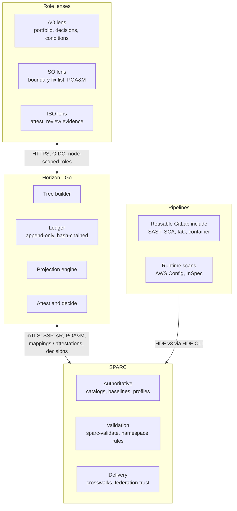

# 02 Architecture

One Go binary with an embedded TypeScript UI, shipped as a distroless container. Results and mappings flow up; attestations and decisions flow down.



## Components

| Component | Responsibility |
|---|---|
| Tree builder | Joins party UUIDs, SSP metadata, components, and inventory items into the federation, organization, boundary, and system tree |
| Ledger | Append-only, hash-chained events for results, attestations, decisions, and expiries |
| Projection engine | Computes the state of any control, cell, or node at any date; materializes horizon buckets |
| Attest and decide | M&O lifecycle, evidence handling, signing, AO risk acceptance, OSCAL and `saf attest` emission |
| Federation | Pulls signed bundles from peer SPARC instances; builds the reverse-inheritance index for blast radius |
| API | chi router implementing [API v0](04-api.md) |

## Repository layout

```text
horizon/
  cmd/horizon/          serve | ingest | rebuild | verify
  internal/sparc/       mTLS client, ETag cache, doc fetch
  internal/oscal/       go-oscal adapters, control-id normalization
  internal/tree/        federation, org, boundary, system builder
  internal/authz/       responsible-parties to node-scoped roles, OIDC
  internal/ledger/      append-only, hash-chained events
  internal/project/     StateAt, rollups, horizon buckets, ranking
  internal/attest/      lifecycle, evidence, signing, saf attest emit
  internal/decide/      risk acceptance, conditions, POA&M emit
  internal/federate/    peer bundles, reverse-inheritance index
  internal/api/         chi router, OpenAPI v0 handlers
  web/                  TypeScript + Vite SPA, embedded via go:embed
  fixtures/             deterministic OSCAL federation
  deploy/helm/  deploy/terraform/
```

## Dependencies

| Need | Choice | Why |
|---|---|---|
| OSCAL types | `github.com/defenseunicorns/go-oscal` | Maintained Go structs. Confirm 1.2.x coverage in phase 0; fall back to types generated from the NIST JSON schemas |
| HDF types | Generated from the HDF v3 JSON schema | Only needed to read raw HDF from back-matter for provenance views |
| Storage | `modernc.org/sqlite`, Postgres optional | Pure Go, so `CGO_ENABLED=0` and a static binary |
| HTTP | `github.com/go-chi/chi/v5` | Standard `net/http` handlers, small surface |
| Identity | `github.com/coreos/go-oidc/v3` | Works with agency IdPs; groups map to node roles |
| UUIDs | `github.com/google/uuid` (`NewSHA1`) | UUIDv5 over natural keys for idempotent reruns |
| UI | TypeScript, Vite, CSS grid heatmap | No chart library needed for the HUD; add ECharts later for trends only |
