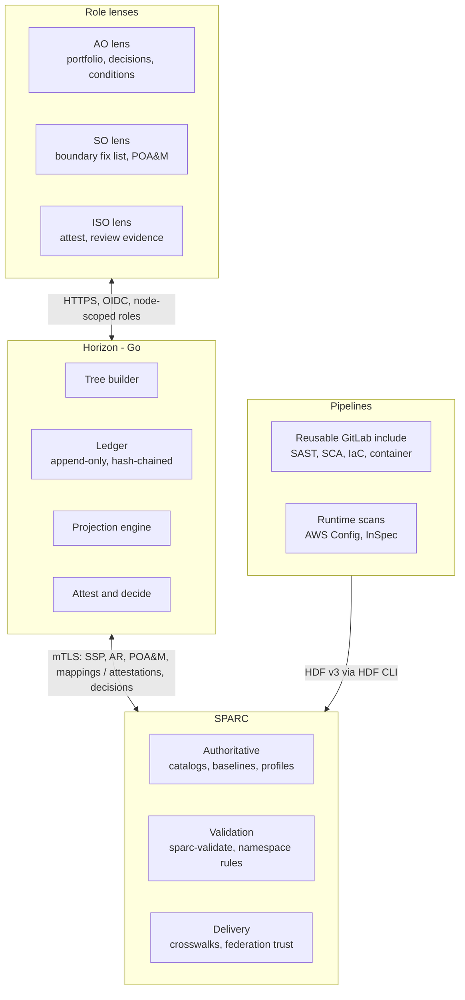

# 02 Architecture

One Go binary with an embedded TypeScript UI, shipped as a distroless container. Results and mappings flow up; attestations and decisions flow down.



## Components

| Component | Responsibility |
|---|---|
| Tree builder | Joins party UUIDs, SSP metadata, components, and inventory items into the federation, organization, boundary, and system tree |
| Ledger | Append-only, hash-chained events for results, attestations, decisions, and expiries |
| Projection engine | Computes the state of any control, cell, or node at any date; materializes horizon buckets |
| Attest and decide | M&O lifecycle, evidence handling, signing, AO risk acceptance, OSCAL and `saf attest` emission |
| Federation | Pulls signed bundles from peer SPARC instances; builds the reverse-inheritance index for blast radius |
| API | chi router implementing [API v0](04-api.md) |

## Repository layout

The Go module is rooted at the **repository**, not at `horizon/`: `go.mod` landed at the top
level with the first package (#38), and the `horizon/` directory is an empty placeholder left
from the original sketch.

```text
  cmd/horizon/          serve | ingest | rebuild | verify
  cmd/genfixtures/      writes fixtures/ — the deterministic federation
  cmd/oscalprobe/       round-trip fidelity matrix, by hand (#26, #49)
  internal/canonical/   field normalisation for derived identifiers
  internal/keys/        the UUIDv5 key grammar, Go reference implementation
  internal/fixtures/    the fixture generator
  internal/sparc/       mTLS client, ETag cache, doc fetch
  internal/oscal/       version dispatch, round-trip probe, go-oscal adapters
  internal/tree/        federation, org, boundary, system builder
  internal/authz/       responsible-parties to node-scoped roles, OIDC
  internal/ledger/      append-only, hash-chained events
  internal/project/     StateAt, rollups, horizon buckets, ranking
  internal/attest/      lifecycle, evidence, signing, saf attest emit
  internal/decide/      risk acceptance, conditions, POA&M emit
  internal/federate/    peer bundles, reverse-inheritance index
  internal/api/         chi router, OpenAPI v0 handlers
  web/                  TypeScript + Vite SPA, embedded via go:embed
  fixtures/             deterministic OSCAL federation, generated (#36)
  deploy/helm/  deploy/terraform/
```

## Dependencies

| Need | Choice | Why |
|---|---|---|
| OSCAL types | `github.com/defenseunicorns/go-oscal`, pinned | **Decided in P0 (#26), re-tested in #49.** v0.7.1 ships type packages for 1.1.x through 1.2.2; all seven models Horizon reads are present. Eight published NIST documents round-trip losslessly at their declared version apart from timestamp normalisation — **except `results[*].local-definitions`, where `tasks` and `assessment-assets` are never modelled at any version, because `go-oscal` collapses OSCAL's four differently-shaped `local-definitions` assemblies into one Go type. The same collapse lets the types emit a document OSCAL rejects, so validate what Horizon writes.** The "generate from the NIST schemas" fallback is the same generator self-hosted — `go-oscal` *is* a schema-to-types generator — so it buys no fidelity. **Parse for reading, never to reproduce a signed document:** hash and verify the received bytes |
| HDF types | Generated from the HDF v3 JSON schema | Only needed to read raw HDF from back-matter for provenance views |
| Storage | `modernc.org/sqlite`, Postgres optional | Pure Go, so `CGO_ENABLED=0` and a static binary |
| HTTP | `github.com/go-chi/chi/v5` | Standard `net/http` handlers, small surface |
| Identity | `github.com/coreos/go-oidc/v3` | Works with agency IdPs; groups map to node roles |
| UUIDs | `github.com/google/uuid` (`NewSHA1`), pinned | UUIDv5 over natural keys for idempotent reruns. **In P0 (#36)** it is a direct dependency of `internal/keys` |
| UI | TypeScript, Vite, CSS grid heatmap | No chart library needed for the HUD; add ECharts later for trends only |

**Documents arrive at more than one OSCAL version.** NIST's own published examples declare
1.1.2, 1.1.3 and 1.2.2 across the models Horizon reads, while Horizon's fixtures are 1.2.2 and
`go-oscal` ships a separate type package per version. `internal/oscal` therefore selects the
type package from the document's own `oscal-version` and **rejects a version it does not carry
types for**, rather than decoding with the nearest set — measured in #49, where every document
in the corpus happened to decode identically under all four supported packages. That result is
about this corpus, not a guarantee, which is why the dispatch is explicit.
