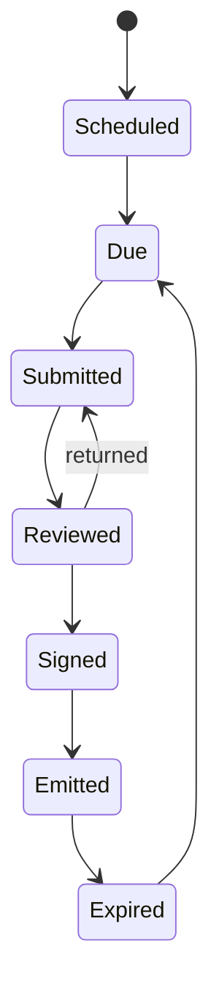

# 06 Attestation workflow

## M&O lifecycle

1. **Scheduled.** A recurrence is created from the control's frequency and the ISO bound to the component.
2. **Due.** The item enters the ISO's HUD as its countdown crosses the lens horizon.
3. **Submitted.** Evidence is uploaded, hashed with SHA-256, and registered as a back-matter resource.
4. **Reviewed.** A second party (SO or assessor) accepts it or returns it with a reason.
5. **Signed.** A detached signature is made over JCS-canonical (RFC 8785) JSON with the SPARC PKI certificate.
6. **Emitted.** An AR observation with `expires` goes to SPARC, and a `saf attest` file goes to the pipeline so the next HDF run applies it.
7. **Expired.** Confidence decays toward the expiry date; at expiry the control is down and the cycle restarts.

## Signing operates on bytes, not on objects

A detached signature covers the JCS-canonical form of the JSON **as received**. It is never
computed over a document that has been parsed into typed structs and serialised again.

The reason is measurable rather than theoretical (#26). Typed OSCAL carries timestamps as
`time.Time`, so `2026-03-31T19:45:48.195797+00:00` re-serialises as
`2026-03-31T19:45:48.195797Z` — the same instant, different bytes. RFC 8785 canonicalises
object member order and number formatting; it does **not** normalise string values, and a
timestamp is a JSON string. The two forms therefore have different digests, and a signature
verified against the re-serialised form fails on a document nobody altered.

So:

- **Verify** against the bytes as they arrived. Keep them; do not reconstruct them.
- **Hash** back-matter resources over the stored bytes, which is what the resource's hash
  claims about.
- **Emit** through one canonical serialiser, so a document Horizon authors has one byte form
  and its signature is reproducible by anyone who re-exports it.
- Parse into types to **read and compute**. That is what the type layer is for.

This is the same property the recompute audit test depends on: if re-export cannot reproduce
the bytes, a peer cannot verify what Horizon signed.

## Hybrid controls

A hybrid control is green only when both the provider's and consumer's responsibility halves have current observations. Each half is attested separately by its own ISO.

## AO decisions

- Accepting a risk sets it to `deviation-approved` with a `risk-log` entry by the AO party.
- The decision carries `condition-expires` and `trigger` props from the namespace.
- A breached trigger or passed expiry reopens the risk and returns it to the AO's HUD.
- POA&M items are emitted back through SPARC.

## What-if

Simulated attestations and remediations run on a copy-on-write overlay. They show deltas at every tier but are never persisted and cannot emit OSCAL or `saf attest` files.
