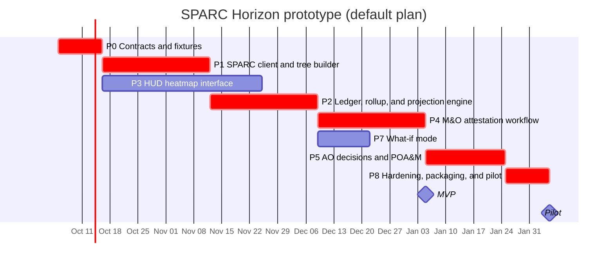

# Roadmap

Default plan: two engineers with AI-assisted coding, 20% buffer applied per phase, starting 2026-10-05. Optional scope in the default: P7 what-if mode and P5 AO decisions. P6 federation sync is out of the default scope.

Use [`demo/planner.html`](../demo/planner.html) to re-plan with a different team size, start date, buffer, scope, or per-phase effort.

| Milestone | Date |
|---|---|
| Demo-ready MVP (end of P4) | 2027-01-05 |
| Pilot-ready prototype (end of P8) | 2027-02-05 |
| Calendar | 17.6 weeks |

Critical-path phases are marked `crit`. The planner splits free engineers across phases that become ready at the same time, adds 10% coordination overhead per extra person on a phase, and reduces effort by 20% with AI-assisted coding.

## P0 Contracts and fixtures

Lock the data contracts that every later phase joins on, so interface and engine work can run in parallel.

- **Base effort:** 3 engineer-weeks, up to 2 people
- **Depends on:** nothing
- **Default schedule:** 2026-10-05 to 2026-10-16

### Tasks

- Publish the SPARC namespace JSON Schema (node-type, parent-uuid, next-decision-date, fips-199, blocks-ato, evidence-kind, signed-by, condition-expires, trigger)
- Define the UUIDv5 key grammar per object type, with reference functions in Go, Ruby, and Python
- Add sparc-validate rules that reject SSP, AR, and POA&M documents missing required props
- Generate a deterministic fixture federation: 4 organizations, 7 boundaries, about 20 systems, OSCAL 1.2.x
- Freeze API v0 as OpenAPI and stand up a mock server from it
- Decide go-oscal versus generated types after a 1.2.x coverage spike

### Deliverables

- Namespace schema v1
- openapi.yaml and mock server
- fixtures/ repository
- New sparc-validate rules

### Exit criteria

- Fixtures pass sparc-validate
- UUIDs identical across two regenerations
- OpenAPI reviewed by both the engine and interface owners

### Risks

- Namespace churn after interface work starts: version it and allow additive changes only

## P1 SPARC client and tree builder

Turn SPARC documents into the federation, organization, boundary, and system tree, with roles attached.

- **Base effort:** 4 engineer-weeks, up to 2 people
- **Depends on:** P0
- **Default schedule:** 2026-10-16 to 2026-11-12

### Tasks

- Go SPARC client over mTLS with ETag caching for SSP, AR, POA&M, and mapping documents
- Parse OSCAL and normalize control IDs (ac-2.1 and AC-2(1)) using SPARC mappings
- Join party UUIDs and member-of-organizations into the tree; components and inventory-items become systems
- Map responsible-parties to node-scoped roles and OIDC subjects
- Report orphaned or inconsistent parties instead of dropping them

### Deliverables

- internal/sparc
- internal/oscal
- internal/tree
- internal/authz

### Exit criteria

- Fixture tree matches the golden JSON
- Role tests pass for AO at organization and SO and ISO at boundary

### Risks

- Party UUID drift between documents: caught by validate rules and orphan reports

## P3 HUD heatmap interface

Build the tiered HUD against the mock API so it is ready when the engine lands.

- **Base effort:** 6 engineer-weeks, up to 2 people
- **Depends on:** P0
- **Default schedule:** 2026-10-16 to 2026-11-25

### Tasks

- TypeScript and Vite SPA embedded in the binary with go:embed
- Tiered heatmap with breadcrumb, row drill, and cell drill panel
- Look-ahead slider that snaps to decision dates; nominal column collapse
- Projection banner and next-best-action card per lens
- Control detail with the OSCAL evidence chain
- Accessibility: cells as buttons, blocker glyphs, keyboard paths, reduced motion, both themes

### Deliverables

- web/ application
- Component and accessibility test suites

### Exit criteria

- Moderated session with 3 ISOs and 1 AO: top blocker found in under 30 seconds
- axe checks clean for WCAG 2.2 AA

### Risks

- Ranking puts the wrong item first: weights are configurable and every ranking is logged

## P2 Ledger, rollup, and projection engine

Compute the state of any control, cell, or node at any future date, cheaply and reproducibly.

- **Base effort:** 4 engineer-weeks, up to 2 people
- **Depends on:** P1
- **Default schedule:** 2026-11-12 to 2026-12-09

### Tasks

- Append-only, hash-chained ledger on pure-Go SQLite, with a Postgres option
- StateAt from finding status, observation expires, POA&M milestones, and risk status
- Rollups: blockers propagate as any, scores weighted by FIPS 199, inheritance through inherited and satisfied statements
- Materialized projections per node and horizon bucket, invalidated along node ancestry
- Heat endpoint with column ordering, collapse, and axis swap through mapping documents

### Deliverables

- internal/ledger
- internal/project
- Heat and cell endpoints

### Exit criteria

- Golden table tests pass
- p95 under 300 ms at 10,000 controls
- Recompute-from-OSCAL audit test passes

### Risks

- Stale projection cache: ancestry invalidation plus a full rebuild command

## P4 M&O attestation workflow

Let an ISO close a manual control end to end, with evidence that holds up in an audit.

- **Base effort:** 4 engineer-weeks, up to 2 people
- **Depends on:** P2
- **Default schedule:** 2026-12-09 to 2027-01-05

### Tasks

- Lifecycle: scheduled, due, submitted, reviewed, signed, expired
- Evidence upload to the object store, SHA-256 hashing, back-matter resource creation
- Detached signatures over JCS-canonical JSON with the SPARC PKI certificate
- Emit AR observations with expires, plus saf attest files for pipeline re-apply
- Hybrid splits: a cell turns green only when both responsibility halves are current

### Deliverables

- internal/attest
- ISO lens workflows

### Exit criteria

- Round trip: attest in the UI, reach SPARC, re-apply through HDF, and see the cell turn green at every tier

### Risks

- PKI not reachable in the prototype environment: a dev CA behind the same interface

## P7 What-if mode (optional, in default scope)

Show the payoff of an action at every tier before anyone takes it.

- **Base effort:** 2 engineer-weeks, up to 1 person
- **Depends on:** P2, P3
- **Default schedule:** 2026-12-09 to 2026-12-22

### Tasks

- Copy-on-write ledger overlay keyed by an overlay ID
- Simulate attestations and remediations
- Tier-by-tier deltas in the HUD banner
- Guarantee overlays never persist or emit OSCAL

### Deliverables

- POST /v1/whatif
- Simulation banner and reset

### Exit criteria

- Simulated actions show deltas at every tier and clear on reset
- A test proves no ledger writes happen from an overlay

### Risks

- Users mistake a simulation for a real change: persistent banner, distinct color

## P6 Federation sync and blast radius (optional, not in default scope)

Make a provider lapse visible to every leveraging boundary across the federation.

- **Base effort:** 4 engineer-weeks, up to 2 people
- **Depends on:** P2

### Tasks

- Pull signed attestation bundles from peer SPARC instances over mTLS
- Verify signatures and provenance before ingestion
- Resolve leveraged-authorizations into a reverse-inheritance index
- Blast-radius query and highlighting in the heatmap

### Deliverables

- internal/federate
- GET /v1/nodes/{id}/blast-radius

### Exit criteria

- A lapse at a peer instance lights up leveraging boundaries within one sync interval

### Risks

- Peer API contract not ready: exchange signed bundles as files first

## P5 AO decisions and POA&M (optional, in default scope)

Give the AO a decision surface whose conditions enforce themselves.

- **Base effort:** 3 engineer-weeks, up to 1 person
- **Depends on:** P4
- **Default schedule:** 2027-01-05 to 2027-01-25

### Tasks

- Risk acceptance with conditions, expiry, and triggers
- deviation-approved status with risk-log entries by the AO party
- POA&M emission back through SPARC
- Reopen on trigger breach and surface it on the AO lens

### Deliverables

- internal/decide
- AO lens landing view

### Exit criteria

- A fixture condition breach reopens the decision within one projection cycle

### Risks

- AOs want different condition types: start with date and score thresholds only

## P8 Hardening, packaging, and pilot

Ship a container that passes your own pipeline and run the pilot demo on a real boundary.

- **Base effort:** 3 engineer-weeks, up to 3 people
- **Depends on:** all other included phases
- **Default schedule:** 2027-01-25 to 2027-02-05

### Tasks

- Distroless, non-root, static image with an SBOM and signature
- Helm chart and Terraform module
- Run Horizon through the reusable SAF pipeline and produce its own OSCAL package
- Audit export of the ledger chain head
- Pilot demo with one real boundary and its AO

### Deliverables

- Signed image
- deploy/helm and deploy/terraform
- Pilot demo recording

### Exit criteria

- Image passes the reusable pipeline gates
- AO completes the demo script unassisted

### Risks

- Real boundary data exposes missing namespace props: run sparc-validate on it in week one
